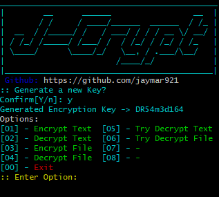
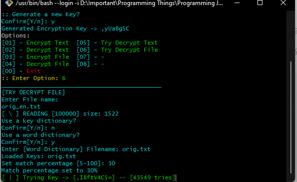

# J-Crypt
> By JayMar921
### Encryption/Decryption - University Project
J-Crypt is a Java Program that encrypt/decrypts a String. You can use your own key for strong encryption, there is also an option for generating a key.
For best Encryption, I highly recommend to make your own keys that is 15 up characters in length, it should contain Symbols, Upper/Lower case Characters and numbers. example: `Th!$keyI$N0t$ecured`


### Clone
- `git clone https://github.com/jaymar921/J-Crypt`
### go to directory
- `cd J-Crypt`
### Run the Jar
There are two options to run the Jar file
- run the `executeJar.sh` 
- run it in console with this command `java -jar JCrypt.jar`



### Options
> - Encrypt and Decrypt text option, the String will be typed by the user. The encryption and decription will use the key that was generated/entered upon program start.
> - Encrypt and Decrypt file option, the user will provide an absolute path for the file to use. The encryption and decription will use the key that was generated/entered upon program start.
> - Try Decrypt text option, the String will be typed by the user, the user can provide a key dictionary or just use random for decryption process to start.
> - Try Decrypt file option, it will require an absolute path for the file to use, the user can use a key dictionary or random keys for decryption process, you can provide a word dictionary that is space separated for matching purpose. You can set the match percentage, 5% to 100%, I recommend at least (80%)
> ### NOTE:
> - use the 'Try Decrypt Text/File' option if you think that the encrypted file uses the program generated key.
### Use this program in your system?
[](https://jitpack.io/#jaymar921/J-Crypt)
#### Maven Repository
```maven
<repositories>
	<repository>
		 <id>jitpack.io</id>
		 <url>https://jitpack.io</url>
	</repository>
</repositories>
  ```
#### Maven Dependency
```maven
<dependency>
	 <groupId>com.github.jaymar921</groupId>
	 <artifactId>J-Crypt</artifactId>
	 <version>-b0588e8fff-1</version>
</dependency>
```
#### Gradle, put this at the end of your repositories
```gradle
allprojects {
	repositories {
		...
		maven { url 'https://jitpack.io' }
	}
}
```
#### Gradle, add the dependency
```gradle
dependencies {
	 implementation 'com.github.jaymar921:J-Crypt:Tag'
}
```
### Using the Encryptor
